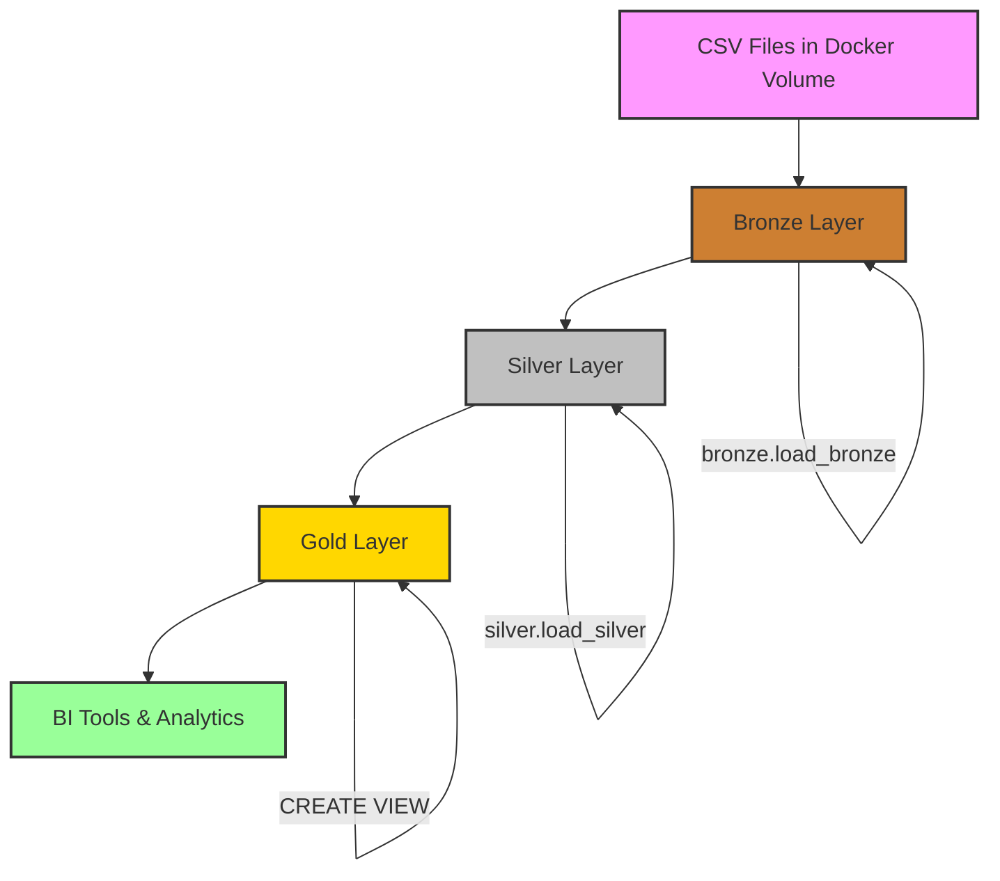

## Overview

Data flows through the warehouse in a linear, three-stage pipeline. Each stage transforms data progressively from raw files to analytics-ready models.



## Stage 1: CSV File Ingestion → Bronze

### Source Data

CSV files are mounted into the PostgreSQL container via Docker volume:

```yaml
volumes:
  - ./datasets:/datasets:ro
```

This creates the following structure inside the container:

```
/datasets/
├── source_crm/
│   ├── cust_info.csv
│   ├── prd_info.csv
│   └── sales_details.csv
└── source_erp/
    ├── CUST_AZ12.csv
    ├── LOC_A101.csv
    └── PX_CAT_G1V2.csv
```

### Loading Process

Execute the Bronze loading procedure:

```sql
CALL bronze.load_bronze();
```

### Execution Flow

The procedure loads each table sequentially with timing and error handling:

<Steps>
  <Step title="Initialize">
    ```sql
    DECLARE
      v_step TEXT;
      v_ok int := 0;
      v_err int := 0;
      v_msg TEXT;
      v_start_batch timestamp := clock_timestamp();
    BEGIN
      RAISE NOTICE '[%] load bronze started', to_char(clock_timestamp(), 'HH24:MI:SS');
    ```
    
    Sets up tracking variables for success/error counts and timing.
  </Step>
  
  <Step title="Load CRM Customer Info">
    ```sql
    v_step := 'load bronze.crm_cust_info';
    TRUNCATE TABLE bronze.crm_cust_info;
    COPY bronze.crm_cust_info
      FROM '/datasets/source_crm/cust_info.csv'
      WITH (FORMAT csv, HEADER true);
    v_ok := v_ok + 1;
    RAISE NOTICE 'Step [%] completed successfully (%.0f s)', v_step, ...;
    ```
    
    **Result**: ~18,484 customer records loaded
  </Step>
  
  <Step title="Load CRM Product Info">
    ```sql
    v_step := 'load bronze.crm_prd_info';
    TRUNCATE TABLE bronze.crm_prd_info;
    COPY bronze.crm_prd_info
      FROM '/datasets/source_crm/prd_info.csv'
      WITH (FORMAT csv, HEADER true);
    ```
    
    **Result**: Product catalog with historical versions loaded
  </Step>
  
  <Step title="Load CRM Sales Details">
    ```sql
    v_step := 'load bronze.crm_sales_details';
    TRUNCATE TABLE bronze.crm_sales_details;
    COPY bronze.crm_sales_details
      FROM '/datasets/source_crm/sales_details.csv'
      WITH (FORMAT csv, HEADER true);
    ```
    
    **Result**: Sales transaction history loaded
  </Step>
  
  <Step title="Load ERP Customer Demographics">
    ```sql
    v_step := 'load bronze.erp_cust_az12';
    TRUNCATE TABLE bronze.erp_cust_az12;
    COPY bronze.erp_cust_az12
      FROM '/datasets/source_erp/CUST_AZ12.csv'
      WITH (FORMAT csv, HEADER true);
    ```
    
    **Result**: Customer birth dates and gender loaded
  </Step>
  
  <Step title="Load ERP Location Data">
    ```sql
    v_step := 'load bronze.erp_loc_a101';
    TRUNCATE TABLE bronze.erp_loc_a101;
    COPY bronze.erp_loc_a101
      FROM '/datasets/source_erp/LOC_A101.csv'
      WITH (FORMAT csv, HEADER true);
    ```
    
    **Result**: Customer country information loaded
  </Step>
  
  <Step title="Load ERP Product Categories">
    ```sql
    v_step := 'load bronze.erp_px_cat_g1v2';
    TRUNCATE TABLE bronze.erp_px_cat_g1v2;
    COPY bronze.erp_px_cat_g1v2
      FROM '/datasets/source_erp/PX_CAT_G1V2.csv'
      WITH (FORMAT csv, HEADER true);
    ```
    
    **Result**: Product category mappings loaded
  </Step>
  
  <Step title="Finalize">
    ```sql
    v_end_batch := clock_timestamp();
    RAISE NOTICE '[%] load bronze finished', to_char(v_end_batch, 'HH24:MI:SS');
    RAISE NOTICE 'load bronze finished in [%] seconds', 
                 extract(epoch FROM (v_end_batch - v_start_batch));
    END;
    ```
    
    **Output**: Total execution time logged
  </Step>
</Steps>

### Sample Output Log

```
NOTICE:  [14:32:15] load bronze started
NOTICE:  Step [load bronze.crm_cust_info] completed successfully (2 s)
NOTICE:  Step [load bronze.crm_prd_info] completed successfully (0 s)
NOTICE:  Step [load bronze.crm_sales_details] completed successfully (3 s)
NOTICE:  Step [load bronze.erp_cust_az12] completed successfully (1 s)
NOTICE:  Step [load bronze.erp_loc_a101] completed successfully (1 s)
NOTICE:  Step [load bronze.erp_px_cat_g1v2] completed successfully (0 s)
NOTICE:  [14:32:22] load bronze finished
NOTICE:  load bronze finished in [7] seconds
```

<Info>
  The Bronze loading process typically completes in under 10 seconds for moderate datasets.
</Info>

## Stage 2: Bronze → Silver Transformation

### Transformation Process

Execute the Silver transformation procedure:

```sql
CALL silver.load_silver();
```

This orchestrates six parallel transformation streams:

### CRM Data Transformations

<Tabs>
  <Tab title="Customer Info">
    **Source**: `bronze.crm_cust_info`  
    **Target**: `silver.crm_cust_info`
    
    **Transformations Applied**:
    
    ```sql
    INSERT INTO silver.crm_cust_info (
      cst_id, cst_key, cst_firstname, cst_lastname,
      cst_marital_status, cst_gndr, cst_create_date
    )
    SELECT
      cst_id,
      TRIM(cst_key),
      TRIM(cst_firstname),
      TRIM(cst_lastname),
      -- Decode marital status
      CASE UPPER(TRIM(cst_marital_status))
        WHEN 'S' THEN 'Single'
        WHEN 'M' THEN 'Married'
        ELSE 'n/a'
      END,
      -- Decode gender
      CASE UPPER(TRIM(cst_gndr))
        WHEN 'M' THEN 'Male'
        WHEN 'F' THEN 'Female'
        ELSE 'n/a'
      END,
      cst_create_date
    FROM (
      SELECT *,
        ROW_NUMBER() OVER (
          PARTITION BY cst_id 
          ORDER BY cst_create_date DESC
        ) AS flag_last
      FROM bronze.crm_cust_info
    )
    WHERE flag_last = 1;  -- Keep only latest record per customer
    ```
    
    **Cleansing Actions**:
    - Trim whitespace from text fields
    - Expand marital status codes (S → Single, M → Married)
    - Expand gender codes (M → Male, F → Female)
    - Deduplicate by keeping most recent record per customer ID
  </Tab>
  
  <Tab title="Product Info">
    **Source**: `bronze.crm_prd_info`  
    **Target**: `silver.crm_prd_info`
    
    **Transformations Applied**:
    
    ```sql
    INSERT INTO silver.crm_prd_info (
      prd_id, cat_id, prd_key, prd_name, 
      prd_cost, prd_line, prd_start_dt, prd_end_dt
    )
    SELECT
      prd_id,
      -- Extract category ID from product key
      REPLACE(SUBSTRING(TRIM(prd_key), 1, 5), '-', '_') AS cat_id,
      -- Extract actual product key
      SUBSTRING(prd_key, 7, LENGTH(prd_key)) AS prd_key,
      prd_name,
      COALESCE(prd_cost, 0) AS prd_cost,
      -- Decode product line
      CASE UPPER(TRIM(prd_line))
        WHEN 'M' THEN 'Mountain'
        WHEN 'R' THEN 'Road'
        WHEN 'S' THEN 'Other sales'
        WHEN 'T' THEN 'Touring'
        ELSE 'n/a'
      END AS prd_line,
      prd_start_dt,
      -- Calculate end date using LEAD window function
      LEAD(prd_start_dt) OVER (
        PARTITION BY prd_key 
        ORDER BY prd_start_dt
      ) - 1 AS prd_end_dt
    FROM bronze.crm_prd_info;
    ```
    
    **Cleansing Actions**:
    - Split composite product key into category ID and product key
    - Replace nulls in cost with 0
    - Decode single-character product lines to full names
    - Calculate end dates using LEAD window function
  </Tab>
  
  <Tab title="Sales Details">
    **Source**: `bronze.crm_sales_details`  
    **Target**: `silver.crm_sales_details`
    
    **Transformations Applied**:
    
    ```sql
    INSERT INTO silver.crm_sales_details (
      sls_ord_num, sls_prd_key, sls_cust_id,
      sls_ord_dt, sls_ship_dt, sls_due_dt,
      sls_sales, sls_quantity, sls_price
    )
    SELECT
      sls_ord_num,
      sls_prd_key,
      sls_cust_id,
      -- Convert integer dates to DATE type
      CASE
        WHEN sls_ord_dt IS NULL OR sls_ord_dt = 0 
          OR LENGTH(sls_ord_dt::text) != 8
        THEN NULL
        ELSE TO_DATE(TRIM(sls_ord_dt::text), 'YYYYMMDD')
      END AS sls_ord_dt,
      CASE
        WHEN sls_ship_dt IS NULL OR sls_ship_dt = 0 
          OR LENGTH(sls_ship_dt::text) != 8
        THEN NULL
        ELSE TO_DATE(TRIM(sls_ship_dt::text), 'YYYYMMDD')
      END AS sls_ship_dt,
      CASE
        WHEN sls_due_dt IS NULL OR sls_due_dt = 0 
          OR LENGTH(sls_due_dt::text) != 8
        THEN NULL
        ELSE TO_DATE(sls_due_dt::text, 'YYYYMMDD')
      END AS sls_due_dt,
      -- Recalculate sales amount if incorrect
      CASE
        WHEN sls_sales IS NULL OR sls_sales <= 0 
          OR sls_sales != sls_quantity * ABS(sls_price)
        THEN sls_quantity * ABS(sls_price)
        ELSE sls_sales
      END AS sls_sales,
      sls_quantity,
      -- Fix negative prices
      CASE
        WHEN sls_price IS NULL OR sls_price = 0
        THEN sls_sales / ABS(sls_quantity)
        WHEN sls_price < 0
        THEN ABS(sls_price)
        ELSE sls_price
      END AS sls_price
    FROM bronze.crm_sales_details;
    ```
    
    **Cleansing Actions**:
    - Convert integer dates (YYYYMMDD) to proper DATE type
    - Validate date lengths (must be 8 digits)
    - Recalculate sales amounts: quantity × price
    - Convert negative prices to positive
    - Calculate missing prices from sales/quantity
  </Tab>
</Tabs>

### ERP Data Transformations

<Tabs>
  <Tab title="Customer Demographics">
    **Source**: `bronze.erp_cust_az12`  
    **Target**: `silver.erp_cust_az12`
    
    ```sql
    INSERT INTO silver.erp_cust_az12 (cid, bdate, gen)
    SELECT
      -- Remove NAS prefix from customer IDs
      CASE
        WHEN cid LIKE 'NAS%' THEN SUBSTRING(cid, 4, LENGTH(cid))
        ELSE cid
      END AS cid,
      -- Validate birth dates
      CASE
        WHEN bdate > CURRENT_DATE THEN NULL
        ELSE bdate
      END AS bdate,
      -- Standardize gender values
      CASE
        WHEN UPPER(TRIM(gen)) IN ('F', 'FEMALE') THEN 'Female'
        WHEN UPPER(TRIM(gen)) IN ('M', 'MALE') THEN 'Male'
        ELSE 'n/a'
      END AS gen
    FROM bronze.erp_cust_az12;
    ```
    
    **Cleansing Actions**:
    - Remove "NAS" prefix from customer IDs
    - Reject future birth dates (set to NULL)
    - Normalize gender to Male/Female/n/a
  </Tab>
  
  <Tab title="Location Data">
    **Source**: `bronze.erp_loc_a101`  
    **Target**: `silver.erp_loc_a101`
    
    ```sql
    INSERT INTO silver.erp_loc_a101 (cid, cntry)
    SELECT
      REPLACE(cid, '-', '') AS cid,
      CASE
        WHEN TRIM(cntry) IN ('USA', 'US') THEN 'United States'
        WHEN TRIM(cntry) = 'CAN' THEN 'Canada'
        WHEN TRIM(cntry) = 'DE' THEN 'Germany'
        WHEN TRIM(cntry) = '' OR TRIM(cntry) IS NULL THEN 'n/a'
        ELSE TRIM(cntry)
      END AS cntry
    FROM bronze.erp_loc_a101;
    ```
    
    **Cleansing Actions**:
    - Remove hyphens from customer IDs
    - Map country codes to full names
    - Handle empty/null countries as 'n/a'
  </Tab>
  
  <Tab title="Product Categories">
    **Source**: `bronze.erp_px_cat_g1v2`  
    **Target**: `silver.erp_px_cat_g1v2`
    
    ```sql
    INSERT INTO silver.erp_px_cat_g1v2 (
      id, cat, subcat, manteinance
    )
    SELECT id, cat, subcat, manteinance
    FROM bronze.erp_px_cat_g1v2;
    ```
    
    **Cleansing Actions**:
    - Direct copy (category data is already clean)
  </Tab>
</Tabs>

### Sample Output Log

```
NOTICE:  [14:32:25] load silver started
NOTICE:  Step [load silver.crm_cust_info] completed successfully (1 s)
NOTICE:  Step [load silver.crm_prd_info] completed successfully (0 s)
NOTICE:  Step [load silver.crm_sales_details] completed successfully (4 s)
NOTICE:  Step [load silver.erp_cust_az12] completed successfully (0 s)
NOTICE:  Step [load silver.erp_loc_a101] completed successfully (0 s)
NOTICE:  Step [load silver.erp_px_cat_g1v2] completed successfully (0 s)
NOTICE:  load silver finished in [5] seconds
NOTICE:  [14:32:30] load silver finished
```

## Stage 3: Silver → Gold Modeling

### Dimensional Modeling

Gold layer views are created once (not called repeatedly like procedures):

```sql
-- Run these DDL statements to create Gold views
\i scripts/gold/ddl_gold.sql
```

### View Creation Flow

<Steps>
  <Step title="Create Customer Dimension">
    ```sql
    CREATE VIEW gold.dim_customer AS
    SELECT
      ROW_NUMBER() OVER (ORDER BY cst_id) AS customer_key,
      ci.cst_id AS customer_id,
      ci.cst_key AS customer_number,
      ci.cst_firstname AS first_name,
      ci.cst_lastname AS last_name,
      ci.cst_marital_status AS marital_status,
      -- Coalesce gender from CRM and ERP
      CASE
        WHEN ci.cst_gndr != 'n/a' THEN ci.cst_gndr
        ELSE COALESCE(ca.gen, 'n/a')
      END AS gender,
      ca.bdate AS birth_date,
      ci.cst_create_date AS create_date
    FROM silver.crm_cust_info ci
    LEFT JOIN silver.erp_cust_az12 ca ON ci.cst_key = ca.cid
    LEFT JOIN silver.erp_loc_a101 la ON ci.cst_key = la.cid;
    ```
    
    **Features**:
    - Generates surrogate key (customer_key) via ROW_NUMBER
    - Joins CRM customer data with ERP demographics
    - Uses fallback logic: prefer CRM gender, fall back to ERP
    - Business-friendly column names (first_name, last_name)
  </Step>
  
  <Step title="Create Product Dimension">
    ```sql
    CREATE VIEW gold.dim_product AS
    SELECT
      ROW_NUMBER() OVER (ORDER BY pn.prd_start_dt, pn.prd_key) AS product_key,
      pn.prd_id AS product_id,
      pn.prd_key AS product_number,
      pn.prd_name AS product_name,
      pn.cat_id AS category_id,
      pc.cat AS category,
      pc.subcat AS subcategory,
      pc.manteinance,
      pn.prd_cost AS product_cost,
      pn.prd_line AS product_line,
      pn.prd_start_dt AS product_start_date
    FROM silver.crm_prd_info pn
    LEFT JOIN silver.erp_px_cat_g1v2 pc ON pn.cat_id = pc.id
    WHERE pn.prd_end_dt IS NULL;
    ```
    
    **Features**:
    - Generates surrogate key (product_key)
    - Enriches CRM products with ERP category hierarchy
    - Filters to active products only (end_dt IS NULL)
    - Provides category, subcategory, and maintenance info
  </Step>
  
  <Step title="Create Sales Fact Table">
    ```sql
    CREATE VIEW gold.fact_sales AS
    SELECT
      si.sls_ord_num AS order_number,
      pr.product_key,
      cu.customer_key,
      si.sls_ord_dt AS order_date,
      si.sls_ship_dt AS shipping_date,
      si.sls_sales AS sales_amount,
      si.sls_quantity AS quantity,
      si.sls_price AS price
    FROM silver.crm_sales_details si
    LEFT JOIN gold.dim_product pr ON si.sls_prd_key = pr.product_number
    LEFT JOIN gold.dim_customer cu ON si.sls_cust_id = cu.customer_id;
    ```
    
    **Features**:
    - References dimension tables via surrogate keys
    - Contains only facts (order number) and foreign keys
    - Includes measures: sales_amount, quantity, price
    - Ready for aggregation and analytical queries
  </Step>
</Steps>

<Warning>
  Views are created in dependency order. `fact_sales` depends on `dim_product` and `dim_customer` existing first.
</Warning>

### Data Integration Examples

<AccordionGroup>
  <Accordion title="Customer with Demographics">
    **Question**: How do we get a customer's birth date?
    
    **Data Flow**:
    ```
    source_crm/cust_info.csv (no birth date)
      ↓
    bronze.crm_cust_info (no birth date)
      ↓
    silver.crm_cust_info (no birth date)
      ↓
    source_erp/CUST_AZ12.csv (has birth date) → bronze.erp_cust_az12 → silver.erp_cust_az12
      ↓
    gold.dim_customer (LEFT JOIN to combine)
    ```
    
    **Query**:
    ```sql
    SELECT customer_id, first_name, last_name, birth_date
    FROM gold.dim_customer
    WHERE birth_date IS NOT NULL;
    ```
  </Accordion>
  
  <Accordion title="Product with Category Hierarchy">
    **Question**: What category does a product belong to?
    
    **Data Flow**:
    ```
    source_crm/prd_info.csv (has product key like "BI-01234")
      ↓
    bronze.crm_prd_info
      ↓
    silver.crm_prd_info (extracts cat_id = "BI_01" from product key)
      ↓
    source_erp/PX_CAT_G1V2.csv (has category info for id "BI_01") → bronze/silver.erp_px_cat_g1v2
      ↓
    gold.dim_product (LEFT JOIN on cat_id = id)
    ```
    
    **Query**:
    ```sql
    SELECT product_name, category, subcategory, product_line
    FROM gold.dim_product
    WHERE category = 'Bikes';
    ```
  </Accordion>
  
  <Accordion title="Sales with Full Context">
    **Question**: Show sales with customer and product details
    
    **Data Flow**:
    ```
    source_crm/sales_details.csv
      ↓
    bronze.crm_sales_details
      ↓
    silver.crm_sales_details (cleaned dates and amounts)
      ↓
    gold.fact_sales (JOIN to dim_customer and dim_product)
    ```
    
    **Query**:
    ```sql
    SELECT
      f.order_number,
      c.first_name || ' ' || c.last_name AS customer_name,
      p.product_name,
      p.category,
      f.order_date,
      f.quantity,
      f.sales_amount
    FROM gold.fact_sales f
    JOIN gold.dim_customer c ON f.customer_key = c.customer_key
    JOIN gold.dim_product p ON f.product_key = p.product_key
    WHERE f.order_date >= '2023-01-01';
    ```
  </Accordion>
</AccordionGroup>

## Complete ETL Workflow

### Full Pipeline Execution

To run the complete data pipeline from scratch:

```sql
-- Step 1: Create schemas
\i scripts/SchemaCreator.sql

-- Step 2: Create Bronze tables
\i scripts/bronze/ddl_bronze.sql

-- Step 3: Load Bronze data from CSV files
CALL bronze.load_bronze();

-- Step 4: Create Silver tables
\i scripts/silver/ddl_silver.sql

-- Step 5: Transform Bronze → Silver
CALL silver.load_silver();

-- Step 6: Create Gold views
\i scripts/gold/ddl_gold.sql

-- Step 7: Verify data
SELECT * FROM gold.fact_sales LIMIT 10;
```

### Execution Timeline

| Step | Duration | Action |
|------|----------|--------|
| 1 | < 1s | Schema creation |
| 2 | < 1s | Bronze DDL |
| 3 | ~7s | Load Bronze from CSV |
| 4 | < 1s | Silver DDL |
| 5 | ~5s | Transform to Silver |
| 6 | < 1s | Gold view creation |
| **Total** | **~15s** | Complete pipeline |

<Info>
  The entire pipeline completes in approximately 15 seconds for the sample dataset.
</Info>

## Data Quality Validation

After each stage, validate data quality:

### Bronze Validation

```sql
-- Check row counts
SELECT 'crm_cust_info' AS table_name, COUNT(*) AS row_count 
FROM bronze.crm_cust_info
UNION ALL
SELECT 'crm_sales_details', COUNT(*) FROM bronze.crm_sales_details;

-- Check for null keys
SELECT COUNT(*) AS null_customer_ids
FROM bronze.crm_cust_info
WHERE cst_id IS NULL;
```

### Silver Validation

```sql
-- Verify deduplication
SELECT cst_id, COUNT(*) AS duplicate_count
FROM silver.crm_cust_info
GROUP BY cst_id
HAVING COUNT(*) > 1;

-- Verify date conversions
SELECT 
  COUNT(*) AS total_orders,
  COUNT(sls_ord_dt) AS valid_order_dates,
  COUNT(*) - COUNT(sls_ord_dt) AS invalid_dates
FROM silver.crm_sales_details;

-- Check gender standardization
SELECT cst_gndr, COUNT(*)
FROM silver.crm_cust_info
GROUP BY cst_gndr;
-- Expected: Male, Female, n/a (no single-letter codes)
```

### Gold Validation

```sql
-- Check fact table metrics
SELECT
  COUNT(*) AS total_transactions,
  COUNT(DISTINCT customer_key) AS unique_customers,
  COUNT(DISTINCT product_key) AS unique_products,
  SUM(sales_amount) AS total_sales,
  AVG(sales_amount) AS avg_order_value
FROM gold.fact_sales;

-- Verify dimension integration
SELECT
  COUNT(*) AS total_sales,
  SUM(CASE WHEN customer_key IS NULL THEN 1 ELSE 0 END) AS missing_customer,
  SUM(CASE WHEN product_key IS NULL THEN 1 ELSE 0 END) AS missing_product
FROM gold.fact_sales;
```

## Error Handling

The ETL procedures include comprehensive error handling:

```sql
EXCEPTION WHEN OTHERS THEN
  v_err := v_err + 1;
  v_msg := 'Error in step: ' || v_step || ' - ' || SQLERRM;
  RAISE EXCEPTION '%', v_msg;
```

**Common errors and solutions**:

<AccordionGroup>
  <Accordion title="File Not Found">
    **Error**: `could not open file "/datasets/source_crm/cust_info.csv"`
    
    **Cause**: CSV file missing or Docker volume not mounted
    
    **Solution**:
    - Check that datasets directory exists
    - Verify Docker volume mount in docker-compose.yml
    - Ensure CSV files are present in datasets/source_crm and datasets/source_erp
  </Accordion>
  
  <Accordion title="Permission Denied">
    **Error**: `could not open file for reading: Permission denied`
    
    **Cause**: PostgreSQL user cannot read CSV files
    
    **Solution**:
    - Check file permissions: `chmod 644 datasets/source_crm/*.csv`
    - Verify volume is mounted read-only (`:ro`) in docker-compose.yml
  </Accordion>
  
  <Accordion title="Data Type Mismatch">
    **Error**: `invalid input syntax for type integer`
    
    **Cause**: CSV data doesn't match table column types
    
    **Solution**:
    - Review Bronze table definitions
    - Check CSV file format (delimiters, quotes)
    - Verify CSV headers match table columns
  </Accordion>
  
  <Accordion title="View Dependency Error">
    **Error**: `relation "gold.dim_product" does not exist`
    
    **Cause**: Creating fact_sales before dimensions
    
    **Solution**:
    - Create views in order: dim_customer, dim_product, then fact_sales
    - Run complete ddl_gold.sql script (views are ordered correctly)
  </Accordion>
</AccordionGroup>

## Performance Optimization

### Bulk Loading with COPY

The COPY command is the fastest way to load CSV data:

```sql
COPY bronze.crm_sales_details
  FROM '/datasets/source_crm/sales_details.csv'
  WITH (FORMAT csv, HEADER true);
```

**Performance**: Loads ~60,000 rows in 3-4 seconds

### Truncate vs Delete

Always use TRUNCATE for full table refresh:

```sql
TRUNCATE TABLE silver.crm_sales_details;  -- Fast, resets storage
-- vs
DELETE FROM silver.crm_sales_details;     -- Slow, keeps storage
```

### Window Functions for Deduplication

Efficient deduplication using ROW_NUMBER:

```sql
SELECT * FROM (
  SELECT *,
    ROW_NUMBER() OVER (PARTITION BY cst_id ORDER BY cst_create_date DESC) AS rn
  FROM bronze.crm_cust_info
)
WHERE rn = 1;
```

**Performance**: Single pass over data, no self-joins needed

## Monitoring and Logging

Track ETL execution with built-in logging:

```sql
-- Enable timing in psql
\timing on

-- View procedure output
SET client_min_messages TO NOTICE;

-- Run procedures
CALL bronze.load_bronze();
CALL silver.load_silver();
```

**Sample output with timing**:
```
NOTICE:  [14:32:15] load bronze started
NOTICE:  Step [load bronze.crm_cust_info] completed successfully (2 s)
...
NOTICE:  load bronze finished in [7] seconds
Time: 7123.456 ms (00:07.123)
```

## Data Lineage Tracking

Trace any value back to its source:

**Example**: Customer gender in analytics

```
Gold View Query:
  SELECT gender FROM gold.dim_customer WHERE customer_id = 11000
    → gender = 'Male'
    
Gold View Definition:
  CASE WHEN ci.cst_gndr != 'n/a' THEN ci.cst_gndr ELSE ca.gen END
    → Uses CRM value if available, else ERP
    
Silver CRM:
  SELECT cst_gndr FROM silver.crm_cust_info WHERE cst_id = 11000
    → cst_gndr = 'Male' (decoded from 'M')
    
Silver Transform:
  CASE UPPER(TRIM(cst_gndr)) WHEN 'M' THEN 'Male' ...
    
Bronze CRM:
  SELECT cst_gndr FROM bronze.crm_cust_info WHERE cst_id = 11000
    → cst_gndr = 'M'
    
CSV File:
  datasets/source_crm/cust_info.csv, line 1234
    → 11000,AW00011000,Jon,Yang,M,M,2010-04-01
```

## Next Steps

<CardGroup cols={2}>
  <Card title="Overview" icon="diagram-project" href="/architecture/overview">
    Understand the overall architecture design
  </Card>
  
  <Card title="Medallion Architecture" icon="layer-group" href="/architecture/medallion-architecture">
    Deep dive into each layer's structure
  </Card>
</CardGroup>