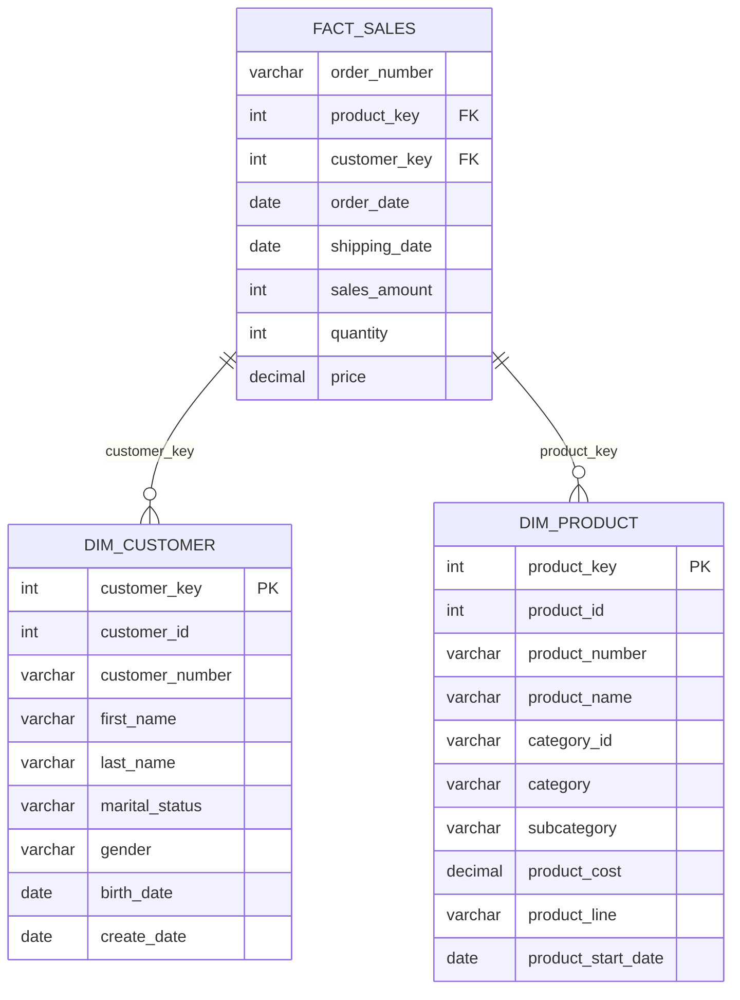

## What is Medallion Architecture?

The Medallion Architecture is a data design pattern that organizes data into three progressive layers of increasing quality and refinement:

- **Bronze**: Raw, unprocessed data from source systems
- **Silver**: Cleaned, validated, and standardized data
- **Gold**: Business-level aggregates and dimensional models

This pattern provides clear data lineage, enables troubleshooting, and supports multiple use cases from data science to business intelligence.

<Info>
  The term "Medallion Architecture" was popularized by Databricks but applies to any data platform, including PostgreSQL-based warehouses.
</Info>

## Bronze Layer: Raw Data Ingestion

### Purpose

The Bronze layer serves as the landing zone for all raw data. Its primary purposes are:

- Preserve data exactly as received from source systems
- Provide an audit trail of all incoming data
- Enable reprocessing without re-extracting from sources
- Support data recovery and historical analysis

### Table Structures

Bronze tables mirror the structure of source files with minimal constraints:

<Tabs>
  <Tab title="CRM Customer Info">
    ```sql
    CREATE TABLE bronze.crm_cust_info (
        cst_id INT,
        cst_key VARCHAR(50),
        cst_firstname VARCHAR(100),
        cst_lastname VARCHAR(100),
        cst_marital_status VARCHAR(100),
        cst_gndr VARCHAR(10),
        cst_create_date DATE
    );
    ```
    
    **Source**: `source_crm/cust_info.csv`
    
    Contains customer master data with potential duplicates and raw codes.
  </Tab>
  
  <Tab title="CRM Product Info">
    ```sql
    CREATE TABLE bronze.crm_prd_info (
        prd_id INT,
        prd_key VARCHAR(50),
        prd_name VARCHAR(100),
        prd_cost DECIMAL(10, 2),
        prd_line CHAR(10),
        prd_start_dt DATE,
        prd_end_dt DATE
    );
    ```
    
    **Source**: `source_crm/prd_info.csv`
    
    Product catalog with encoded product lines (M, R, S, T).
  </Tab>
  
  <Tab title="CRM Sales Details">
    ```sql
    CREATE TABLE bronze.crm_sales_details (
        sls_ord_num VARCHAR(50),
        sls_prd_key VARCHAR(50),
        sls_cust_id INT,
        sls_ord_dt INT,        -- Note: stored as integer YYYYMMDD
        sls_ship_dt INT,
        sls_due_dt INT,
        sls_sales INT,
        sls_quantity INT,
        sls_price DECIMAL(10, 2)
    );
    ```
    
    **Source**: `source_crm/sales_details.csv`
    
    Sales transactions with dates stored as integers requiring conversion.
  </Tab>
  
  <Tab title="ERP Customer Demographics">
    ```sql
    CREATE TABLE bronze.erp_cust_az12 (
        cid VARCHAR(50),       -- Customer ID with potential prefix issues
        bdate DATE,
        gen VARCHAR(10)        -- Gender codes: M, F, Male, Female
    );
    ```
    
    **Source**: `source_erp/CUST_AZ12.csv`
    
    Contains birth dates and gender, may have inconsistent formats.
  </Tab>
  
  <Tab title="ERP Location">
    ```sql
    CREATE TABLE bronze.erp_loc_a101 (
        cid VARCHAR(50),
        cntry VARCHAR(100)     -- Country codes: USA, US, CAN, DE, etc.
    );
    ```
    
    **Source**: `source_erp/LOC_A101.csv`
    
    Customer locations with varying country code formats.
  </Tab>
  
  <Tab title="ERP Product Categories">
    ```sql
    CREATE TABLE bronze.erp_px_cat_g1v2 (
        id VARCHAR(50),
        cat VARCHAR(50),
        subcat VARCHAR(50),
        manteinance VARCHAR(50)
    );
    ```
    
    **Source**: `source_erp/PX_CAT_G1V2.csv`
    
    Product category mappings for enrichment.
  </Tab>
</Tabs>

### Data Loading Process

Bronze tables are loaded using the `bronze.load_bronze()` stored procedure:

```sql
CALL bronze.load_bronze();
```

This procedure:

1. Truncates all Bronze tables (full refresh pattern)
2. Uses PostgreSQL `COPY` command for fast bulk loading
3. Loads data directly from mounted CSV files
4. Logs timing information for each step
5. Handles errors gracefully with exception handling

**Example loading logic** from `scripts/bronze/proc_load_bronze.sql:22-28`:

```sql
TRUNCATE TABLE bronze.crm_cust_info;
COPY bronze.crm_cust_info
  FROM '/datasets/source_crm/cust_info.csv'
  WITH (FORMAT csv, HEADER true);
```

<Note>
  The COPY command requires absolute paths to CSV files, which are made available via Docker volume mounts.
</Note>

### Data Quality Issues in Bronze

Bronze layer intentionally preserves all data quality issues:

- Duplicate customer records with different create dates
- Invalid or missing dates (zeros, wrong lengths)
- Inconsistent code formats (M vs Male, USA vs US)
- Negative prices and incorrect calculations
- Missing or null values
- Leading/trailing whitespace
- Prefixed customer IDs (NAS prefix)
- Hyphens and special characters in IDs

## Silver Layer: Cleaned & Standardized Data

### Purpose

The Silver layer transforms raw Bronze data into clean, consistent, and validated datasets:

- Apply data quality rules and validations
- Standardize formats and data types
- Remove duplicates using business rules
- Decode categorical values
- Fix data inconsistencies

### Enhanced Table Structures

Silver tables add metadata columns and enforce stricter typing:

```sql
CREATE TABLE silver.crm_sales_details (
    sls_ord_num VARCHAR(50),
    sls_prd_key VARCHAR(50),
    sls_cust_id INT,
    sls_ord_dt DATE,           -- Converted from integer
    sls_ship_dt DATE,
    sls_due_dt DATE,
    sls_sales INT,
    sls_quantity INT,
    sls_price DECIMAL(10, 2),
    dwh_create_date TIMESTAMP DEFAULT CURRENT_TIMESTAMP  -- Audit column
);
```

### Data Transformation Examples

<AccordionGroup>
  <Accordion title="Customer Deduplication">
    Removes duplicate customers by keeping only the most recent record:
    
    ```sql
    SELECT *,
      ROW_NUMBER() OVER (
        PARTITION BY cst_id 
        ORDER BY cst_create_date DESC
      ) AS flag_last
    FROM bronze.crm_cust_info
    WHERE flag_last = 1
    ```
    
    This ensures one record per customer ID based on the latest creation date.
  </Accordion>
  
  <Accordion title="Gender Standardization">
    Converts various gender formats to consistent values:
    
    ```sql
    CASE UPPER(TRIM(cst_gndr))
      WHEN 'M' THEN 'Male'
      WHEN 'F' THEN 'Female'
      ELSE 'n/a'
    END AS cst_gndr
    ```
    
    Applied to both CRM and ERP sources for consistency.
  </Accordion>
  
  <Accordion title="Date Conversion & Validation">
    Converts integer dates to proper DATE type with validation:
    
    ```sql
    CASE
      WHEN sls_ord_dt IS NULL
        OR sls_ord_dt = 0
        OR length(sls_ord_dt::text) != 8
      THEN NULL
      ELSE to_date(TRIM(sls_ord_dt::text), 'YYYYMMDD')
    END AS sls_ord_dt
    ```
    
    Handles malformed dates gracefully by setting them to NULL.
  </Accordion>
  
  <Accordion title="Price & Amount Validation">
    Recalculates incorrect sales amounts:
    
    ```sql
    CASE
      WHEN sls_sales IS NULL 
        OR sls_sales <= 0 
        OR sls_sales != sls_quantity * ABS(sls_price)
      THEN sls_quantity * ABS(sls_price)
      ELSE sls_sales
    END AS sls_sales
    ```
    
    Ensures mathematical consistency: sales = quantity × price
  </Accordion>
  
  <Accordion title="Product Line Decoding">
    Expands single-character codes to meaningful names:
    
    ```sql
    CASE UPPER(TRIM(prd_line))
      WHEN 'M' THEN 'Mountain'
      WHEN 'R' THEN 'Road'
      WHEN 'S' THEN 'Other sales'
      WHEN 'T' THEN 'Touring'
      ELSE 'n/a'
    END AS prd_line
    ```
  </Accordion>
  
  <Accordion title="Customer ID Cleaning">
    Removes prefixes and normalizes ID formats:
    
    ```sql
    -- Remove NAS prefix from ERP customer IDs
    CASE
      WHEN cid LIKE 'NAS%' THEN SUBSTRING(cid, 4, LENGTH(cid))
      ELSE cid
    END AS cid
    
    -- Remove hyphens from location IDs
    REPLACE(cid, '-', '') AS cid
    ```
  </Accordion>
  
  <Accordion title="Country Code Standardization">
    Maps various country codes to full names:
    
    ```sql
    CASE
      WHEN TRIM(cntry) IN ('USA','US') THEN 'United States'
      WHEN TRIM(cntry) = 'CAN' THEN 'Canada'
      WHEN TRIM(cntry) = 'DE' THEN 'Germany'
      WHEN TRIM(cntry) = '' OR TRIM(cntry) IS NULL THEN 'n/a'
      ELSE TRIM(cntry)
    END AS cntry
    ```
  </Accordion>
  
  <Accordion title="Product Category Extraction">
    Extracts category ID from product key:
    
    ```sql
    SELECT
      REPLACE(SUBSTRING(TRIM(prd_key), 1, 5), '-','_') AS cat_id,
      SUBSTRING(prd_key, 7, LENGTH(prd_key)) AS prd_key
    FROM bronze.crm_prd_info
    ```
    
    Splits composite product keys into category and product identifiers.
  </Accordion>
</AccordionGroup>

### Loading Silver Data

The `silver.load_silver()` procedure orchestrates all Silver transformations:

```sql
CALL silver.load_silver();
```

**Key features** from `scripts/silver/proc_load_silver.sql:1-290`:

- Truncate-and-insert pattern for each table
- Step-by-step execution with timing
- Exception handling per transformation
- Progress logging with timestamps

## Gold Layer: Analytics-Ready Data

### Purpose

The Gold layer provides business-ready data models optimized for analytics:

- Dimensional modeling (star schema)
- Integration of multiple data sources
- Business-friendly column names
- Optimized for query performance
- Serves BI tools and reporting needs

### Dimensional Model

Gold implements a classic star schema with fact and dimension tables:



### Gold Views

<Tabs>
  <Tab title="dim_customer">
    ```sql
    CREATE VIEW gold.dim_customer AS
    SELECT
      ROW_NUMBER() OVER (ORDER BY cst_id) AS customer_key,
      ci.cst_id AS customer_id,
      ci.cst_key AS customer_number,
      ci.cst_firstname AS first_name,
      ci.cst_lastname AS last_name,
      ci.cst_marital_status AS marital_status,
      CASE
        WHEN ci.cst_gndr != 'n/a' THEN ci.cst_gndr
        ELSE COALESCE(ca.gen, 'n/a')
      END AS gender,
      ca.bdate AS birth_date,
      ci.cst_create_date AS create_date
    FROM silver.crm_cust_info ci
    LEFT JOIN silver.erp_cust_az12 ca ON ci.cst_key = ca.cid
    LEFT JOIN silver.erp_loc_a101 la ON ci.cst_key = la.cid;
    ```
    
    **Integration Points:**
    - Merges CRM customer data with ERP demographics
    - Uses fallback logic for gender (CRM first, then ERP)
    - Generates surrogate key via ROW_NUMBER()
  </Tab>
  
  <Tab title="dim_product">
    ```sql
    CREATE VIEW gold.dim_product AS
    SELECT
      ROW_NUMBER() OVER (ORDER BY pn.prd_start_dt, pn.prd_key) AS product_key,
      pn.prd_id AS product_id,
      pn.prd_key AS product_number,
      pn.prd_name AS product_name,
      pn.cat_id AS category_id,
      pc.cat AS category,
      pc.subcat AS subcategory,
      pc.manteinance,
      pn.prd_cost AS product_cost,
      pn.prd_line AS product_line,
      pn.prd_start_dt AS product_start_date
    FROM silver.crm_prd_info pn
    LEFT JOIN silver.erp_px_cat_g1v2 pc ON pn.cat_id = pc.id
    WHERE pn.prd_end_dt IS NULL;
    ```
    
    **Integration Points:**
    - Enriches CRM products with ERP category information
    - Filters to current products only (prd_end_dt IS NULL)
    - Provides hierarchical category structure
  </Tab>
  
  <Tab title="fact_sales">
    ```sql
    CREATE VIEW gold.fact_sales AS
    SELECT
      si.sls_ord_num AS order_number,
      pr.product_key,
      cu.customer_key,
      si.sls_ord_dt AS order_date,
      si.sls_ship_dt AS shipping_date,
      si.sls_sales AS sales_amount,
      si.sls_quantity AS quantity,
      si.sls_price AS price
    FROM silver.crm_sales_details si
    LEFT JOIN gold.dim_product pr ON si.sls_prd_key = pr.product_number
    LEFT JOIN gold.dim_customer cu ON si.sls_cust_id = cu.customer_id;
    ```
    
    **Features:**
    - Foreign keys to dimension tables via surrogate keys
    - Business-friendly column aliases
    - Ready for aggregation and analysis
  </Tab>
</Tabs>

<Warning>
  Gold views reference other Gold views (fact_sales → dim_product, dim_customer). Ensure views are created in dependency order.
</Warning>

### Business Benefits of Gold Layer

- **Simplified Queries**: Analysts can query denormalized star schema
- **Consistent Metrics**: Single source of truth for business calculations
- **Performance**: Optimized for aggregation queries
- **Documentation**: Clear, self-documenting column names
- **Integration**: Multiple sources combined seamlessly

## Layer Comparison

| Aspect | Bronze | Silver | Gold |
|--------|--------|--------|------|
| **Data Quality** | Raw, uncleaned | Validated & standardized | Business-ready |
| **Schema Type** | Flat tables | Normalized tables | Star schema (views) |
| **Column Names** | Source system names | Cleaned source names | Business-friendly names |
| **Duplicates** | May contain | Deduplicated | Unique by dimension |
| **Null Handling** | As-is from source | Validated/defaulted | Coalesced with fallbacks |
| **Date Formats** | Inconsistent | Standardized DATE type | Standardized DATE type |
| **Codes** | Raw codes (M, F, S) | Decoded to full words | Decoded to full words |
| **Joins** | No joins | Minimal joins | Extensive joins |
| **Purpose** | Audit trail | Data quality | Analytics |
| **Users** | Data engineers | Data engineers | Analysts, BI tools |

## Data Lineage

Clear lineage through all three layers:

```
CSV File (source_crm/cust_info.csv)
  ↓ [COPY command]
Bronze Table (bronze.crm_cust_info)
  ↓ [Data cleansing, deduplication]
Silver Table (silver.crm_cust_info)
  ↓ [JOIN with ERP data, ROW_NUMBER for surrogate key]
Gold View (gold.dim_customer)
  ↓ [JOIN with fact table]
Analytics Query
```

## Best Practices

<CardGroup cols={2}>
  <Card title="Bronze Layer" icon="database">
    - Never modify Bronze data after loading
    - Preserve all source data, even if incorrect
    - Load with truncate-and-insert pattern
    - Use COPY for bulk loading performance
  </Card>
  
  <Card title="Silver Layer" icon="broom">
    - Document all transformation rules
    - Handle NULL values explicitly
    - Add audit columns (dwh_create_date)
    - Test data quality with assertions
  </Card>
  
  <Card title="Gold Layer" icon="star">
    - Use views for flexibility (vs materialized)
    - Generate surrogate keys for dimensions
    - Keep grain of fact tables clear
    - Use business-friendly naming
  </Card>
  
  <Card title="General" icon="check">
    - Run Bronze → Silver → Gold in sequence
    - Monitor ETL execution times
    - Test with quality check queries
    - Document business rules
  </Card>
</CardGroup>

## Next Steps

<Card title="Data Flow" icon="arrow-right-arrow-left" href="/architecture/data-flow">
  See how data flows through the complete pipeline from CSV files to analytics
</Card>