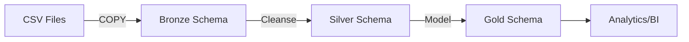

## Introduction

The SQL Data Warehouse project implements a modern, scalable data warehouse solution using PostgreSQL and the Medallion Architecture pattern. This architecture provides a robust framework for ingesting, transforming, and serving data for analytical workloads.

## Architecture Design Principles

The warehouse is built on several key principles:

- **Separation of Concerns**: Each layer has a distinct purpose and operates independently
- **Data Quality**: Progressive refinement of data quality from raw ingestion to business-ready analytics
- **Scalability**: Containerized deployment enables easy scaling and portability
- **Maintainability**: Clear schema separation and stored procedures simplify operations

## Technology Stack

<CardGroup cols={2}>
  <Card title="Database" icon="database">
    **PostgreSQL 16 Alpine**
    
    Production-grade relational database with advanced analytical capabilities
  </Card>
  
  <Card title="Container Platform" icon="docker">
    **Docker & Docker Compose**
    
    Containerized deployment for consistency and portability
  </Card>
  
  <Card title="ETL Framework" icon="gears">
    **PL/pgSQL Stored Procedures**
    
    Native PostgreSQL procedural language for data transformations
  </Card>
  
  <Card title="Data Sources" icon="file-csv">
    **CSV Files (CRM & ERP)**
    
    Flat file ingestion from multiple source systems
  </Card>
</CardGroup>

## Docker Infrastructure

The warehouse runs as a containerized PostgreSQL instance defined in `docker-compose.yml`:

```yaml
services:
  db:
    image: postgres:16-alpine
    container_name: datawarehouse
    restart: unless-stopped

    environment:
      POSTGRES_USER:     ${POSTGRES_USER}
      POSTGRES_PASSWORD: ${POSTGRES_PASSWORD}
      POSTGRES_DB:       ${POSTGRES_DB}
      PGDATA:            /var/lib/postgresql/data/pgdata

    ports:
      - "5432:5432"

    volumes:
      - pg_data:/var/lib/postgresql/data
      - ./datasets:/datasets:ro
```

<Info>
  The datasets directory is mounted as read-only (`ro`) to prevent accidental modification of source data files.
</Info>

## Three-Schema Architecture

The warehouse implements a three-layer schema structure:

```sql
DROP SCHEMA IF EXISTS bronze CASCADE;
CREATE SCHEMA bronze;

DROP SCHEMA IF EXISTS silver CASCADE;
CREATE SCHEMA silver;

DROP SCHEMA IF EXISTS gold CASCADE;
CREATE SCHEMA gold;
```

### Schema Purpose

<Tabs>
  <Tab title="Bronze Schema">
    **Raw Data Layer**
    
    - Stores data exactly as received from source systems
    - No transformations applied
    - Tables mirror source file structures
    - Serves as historical record of original data
    
    **Tables:**
    - `bronze.crm_cust_info` - Customer information from CRM
    - `bronze.crm_prd_info` - Product catalog from CRM
    - `bronze.crm_sales_details` - Sales transactions from CRM
    - `bronze.erp_cust_az12` - Customer demographics from ERP
    - `bronze.erp_loc_a101` - Customer locations from ERP
    - `bronze.erp_px_cat_g1v2` - Product categories from ERP
  </Tab>
  
  <Tab title="Silver Schema">
    **Cleaned & Standardized Layer**
    
    - Data cleansing and quality improvements
    - Standardized formats and data types
    - Deduplication and validation rules
    - Business logic applied
    
    **Transformations:**
    - Date conversions (YYYYMMDD → DATE)
    - Gender/status code expansions (M → Male)
    - Price and amount validations
    - Trimming and standardization
  </Tab>
  
  <Tab title="Gold Schema">
    **Analytics-Ready Layer**
    
    - Star schema dimensional model
    - Optimized for business intelligence queries
    - Combines data from multiple sources
    - Ready for reporting and dashboards
    
    **Objects:**
    - `gold.dim_customer` - Customer dimension
    - `gold.dim_product` - Product dimension
    - `gold.fact_sales` - Sales fact table
  </Tab>
</Tabs>

## Data Sources

The warehouse ingests data from two primary source systems:

### CRM System

Provides customer-facing operational data:

- **cust_info.csv** - Customer master data (18,484 records)
- **prd_info.csv** - Product catalog with pricing
- **sales_details.csv** - Sales order transactions

### ERP System

Provides back-office operational data:

- **CUST_AZ12.csv** - Customer demographics and birth dates
- **LOC_A101.csv** - Customer geographic locations
- **PX_CAT_G1V2.csv** - Product category classifications

<Note>
  Data from CRM and ERP systems is integrated in the Gold layer to provide a unified view for analytics.
</Note>

## ETL Process Flow

The data warehouse follows a sequential ETL pattern:

1. **Extract & Load to Bronze**: Raw CSV files → Bronze tables via `bronze.load_bronze()`
2. **Transform to Silver**: Bronze tables → Silver tables via `silver.load_silver()`
3. **Model to Gold**: Silver tables → Gold views (materialized on query)



## Access Control

The warehouse implements a permissive access model for development:

```sql
GRANT USAGE ON SCHEMA bronze TO PUBLIC;
GRANT EXECUTE ON PROCEDURE bronze.load_bronze TO PUBLIC;

GRANT USAGE ON SCHEMA silver TO PUBLIC;
GRANT SELECT ON ALL TABLES IN SCHEMA silver TO PUBLIC;
GRANT EXECUTE ON PROCEDURE silver.load_silver() TO PUBLIC;
```

<Warning>
  In production environments, implement role-based access control (RBAC) with specific grants per user/role.
</Warning>

## Performance Considerations

### Efficient Data Loading

- Uses PostgreSQL `COPY` command for bulk CSV imports
- Truncate-and-load pattern for full refresh
- Batch processing with transaction management

### Query Optimization

- Gold layer uses views for flexibility
- Indexing strategies can be applied to Silver tables
- Window functions for deduplication (ROW_NUMBER)

### Monitoring

ETL procedures include built-in logging:

```sql
RAISE NOTICE '[%] load bronze started', to_char(clock_timestamp(), 'HH24:MI:SS');
RAISE NOTICE 'Step [%] completed successfully (%.0f s)', v_step, extract(epoch FROM ...);
```

## Architecture Diagram


The complete architecture diagram shows the end-to-end flow from source systems through all three layers to final analytics outputs.

## Next Steps

<CardGroup cols={2}>
  <Card title="Medallion Architecture" icon="layer-group" href="/architecture/medallion-architecture">
    Deep dive into Bronze, Silver, and Gold layers
  </Card>
  
  <Card title="Data Flow" icon="arrow-right-arrow-left" href="/architecture/data-flow">
    Learn how data flows through the warehouse
  </Card>
</CardGroup>