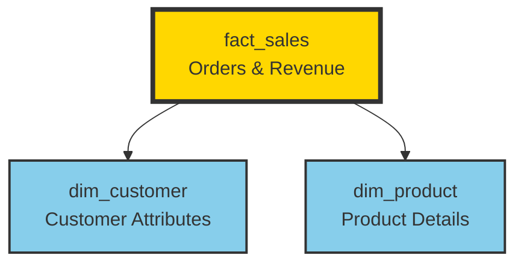

## Overview

The **Gold layer** implements a **star schema** with fact and dimension tables (implemented as views) optimized for analytical queries and business intelligence.

<Info>
  Gold layer objects are implemented as **views** rather than physical tables, ensuring they always reflect the latest Silver data without duplication or sync issues.
</Info>

## Star Schema Architecture

The Gold layer follows a classic star schema design with one fact table and two dimension tables:



<CardGroup cols={3}>
  <Card title="Fact Table" icon="table-cells">
    `fact_sales` - Transactional events with metrics
  </Card>
  <Card title="Dimensions" icon="cube">
    `dim_customer`, `dim_product` - Descriptive attributes
  </Card>
  <Card title="Performance" icon="gauge-high">
    Optimized for aggregations and analytical queries
  </Card>
</CardGroup>

---

## Dimension Tables

### dim_customer

Comprehensive customer dimension combining CRM and ERP data sources.

<Accordion title="View Definition">
```sql
CREATE VIEW gold.dim_customer AS 
SELECT 
    ROW_NUMBER() OVER (ORDER BY cst_id) as customer_key,
    ci.cst_id as customer_id,
    ci.cst_key as customer_number,
    ci.cst_firstname as first_name,
    ci.cst_lastname as last_name,
    ci.cst_marital_status as marital_status,
    CASE 
        WHEN ci.cst_gndr != 'n/a' THEN ci.cst_gndr 
        ELSE COALESCE(ca.gen, 'n/a') 
    END as gender,
    ca.bdate as birth_date,
    ci.cst_create_date as create_date
FROM silver.crm_cust_info ci
LEFT JOIN silver.erp_cust_az12 ca
    ON ci.cst_key = ca.cid
LEFT JOIN silver.erp_loc_a101 la
    ON ci.cst_key = la.cid;
```
</Accordion>

#### Schema

| Column | Type | Description | Source |
|--------|------|-------------|--------|
| `customer_key` | INT | Surrogate key (auto-generated) | Derived |
| `customer_id` | INT | Original customer ID | `crm_cust_info.cst_id` |
| `customer_number` | VARCHAR(50) | Business key | `crm_cust_info.cst_key` |
| `first_name` | VARCHAR(100) | Customer first name | `crm_cust_info.cst_firstname` |
| `last_name` | VARCHAR(100) | Customer last name | `crm_cust_info.cst_lastname` |
| `marital_status` | VARCHAR(100) | Marital status | `crm_cust_info.cst_marital_status` |
| `gender` | VARCHAR(10) | Gender (enriched from ERP) | `crm_cust_info.cst_gndr` or `erp_cust_az12.gen` |
| `birth_date` | DATE | Date of birth | `erp_cust_az12.bdate` |
| `create_date` | DATE | Customer registration date | `crm_cust_info.cst_create_date` |

#### Key Features

<AccordionGroup>
  <Accordion title="Surrogate Key" icon="key">
    `customer_key` is generated using `ROW_NUMBER()` to provide a stable, numeric key for fact table joins, independent of source system IDs.
  </Accordion>
  
  <Accordion title="Data Enrichment" icon="arrows-merge">
    Gender values are enriched using ERP data when CRM has 'n/a':
    ```sql
    CASE 
        WHEN ci.cst_gndr != 'n/a' THEN ci.cst_gndr 
        ELSE COALESCE(ca.gen, 'n/a') 
    END as gender
    ```
  </Accordion>
  
  <Accordion title="Multi-Source Integration" icon="database">
    Combines data from three Silver tables:
    - `silver.crm_cust_info` (primary)
    - `silver.erp_cust_az12` (demographics)
    - `silver.erp_loc_a101` (location)
  </Accordion>
</AccordionGroup>

<Note>
  Birth date comes exclusively from ERP (`erp_cust_az12`), while CRM provides registration and contact details.
</Note>

---

### dim_product

Product dimension with category hierarchy and active product filtering.

<Accordion title="View Definition">
```sql
CREATE VIEW gold.dim_product AS
SELECT
    ROW_NUMBER() OVER (ORDER BY pn.prd_start_dt, pn.prd_key) as product_key,
    pn.prd_id as product_id,
    pn.prd_key as product_number,
    pn.prd_name as product_name,
    pn.cat_id as category_id,
    pc.cat as category,
    pc.subcat as subcategory,
    pc.manteinance,
    pn.prd_cost as product_cost,
    pn.prd_line as product_line,
    pn.prd_start_dt as product_start_date
FROM silver.crm_prd_info pn
LEFT JOIN silver.erp_px_cat_g1v2 pc
    ON pn.cat_id = pc.id
WHERE pn.prd_end_dt IS NULL;
```
</Accordion>

#### Schema

| Column | Type | Description | Source |
|--------|------|-------------|--------|
| `product_key` | INT | Surrogate key (auto-generated) | Derived |
| `product_id` | INT | Original product ID | `crm_prd_info.prd_id` |
| `product_number` | VARCHAR(50) | Business key | `crm_prd_info.prd_key` |
| `product_name` | VARCHAR(100) | Product name | `crm_prd_info.prd_name` |
| `category_id` | VARCHAR(50) | Category identifier | `crm_prd_info.cat_id` |
| `category` | VARCHAR(50) | Primary category | `erp_px_cat_g1v2.cat` |
| `subcategory` | VARCHAR(50) | Subcategory | `erp_px_cat_g1v2.subcat` |
| `manteinance` | VARCHAR(50) | Maintenance classification | `erp_px_cat_g1v2.manteinance` |
| `product_cost` | DECIMAL(10, 2) | Product cost | `crm_prd_info.prd_cost` |
| `product_line` | VARCHAR(50) | Product line | `crm_prd_info.prd_line` |
| `product_start_date` | DATE | Product launch date | `crm_prd_info.prd_start_dt` |

#### Key Features

<AccordionGroup>
  <Accordion title="Active Products Only" icon="filter">
    The view filters for active products only:
    ```sql
    WHERE pn.prd_end_dt IS NULL
    ```
    Discontinued products (with non-null `prd_end_dt`) are excluded from the dimension.
  </Accordion>
  
  <Accordion title="Category Hierarchy" icon="sitemap">
    Joins with ERP category table to provide full classification:
    - `category` - Primary product category
    - `subcategory` - Detailed product subcategory
    - `manteinance` - Maintenance classification
  </Accordion>
  
  <Accordion title="Surrogate Key Generation" icon="key">
    `product_key` ordered by start date and product key:
    ```sql
    ROW_NUMBER() OVER (ORDER BY pn.prd_start_dt, pn.prd_key)
    ```
    Ensures chronological ordering of products.
  </Accordion>
</AccordionGroup>

<Warning>
  Only **active products** (`prd_end_dt IS NULL`) are included. Historical fact records may reference discontinued products, so use `product_number` joins when full history is needed.
</Warning>

---

## Fact Table

### fact_sales

Grain: One row per order line item

Transactional fact table containing sales orders with references to customer and product dimensions.

<Accordion title="View Definition">
```sql
CREATE VIEW gold.fact_sales AS
SELECT
    si.sls_ord_num as order_number,
    pr.product_key,
    cu.customer_key,
    si.sls_ord_dt as order_date,
    si.sls_ship_dt as shipphing_date,
    si.sls_sales as sales_amount,
    si.sls_quantity as quantity,
    si.sls_price as price
FROM silver.crm_sales_details si
LEFT JOIN gold.dim_product pr
    ON si.sls_prd_key = pr.product_number
LEFT JOIN gold.dim_customer cu
    ON si.sls_cust_id = cu.customer_id;
```
</Accordion>

#### Schema

| Column | Type | Description | Fact Type |
|--------|------|-------------|----------|
| `order_number` | VARCHAR(50) | Order identifier (degenerate dimension) | Dimension |
| `product_key` | INT | FK to dim_product | Foreign Key |
| `customer_key` | INT | FK to dim_customer | Foreign Key |
| `order_date` | DATE | Order date | Dimension |
| `shipphing_date` | DATE | Ship date | Dimension |
| `sales_amount` | INT | Total sales revenue | **Measure** |
| `quantity` | INT | Quantity ordered | **Measure** |
| `price` | DECIMAL(10, 2) | Unit price | **Measure** |

#### Key Features

<AccordionGroup>
  <Accordion title="Foreign Keys" icon="link">
    Joins to dimension tables using surrogate keys:
    - `product_key` → `dim_product.product_key`
    - `customer_key` → `dim_customer.customer_key`
    
    Uses LEFT JOIN to preserve fact records even if dimension lookup fails.
  </Accordion>
  
  <Accordion title="Degenerate Dimension" icon="hashtag">
    `order_number` is stored directly in the fact table (degenerate dimension) since it doesn't warrant a separate dimension table.
  </Accordion>
  
  <Accordion title="Date Dimensions" icon="calendar">
    Includes two date columns for time-based analysis:
    - `order_date` - When the order was placed
    - `shipphing_date` - When the order was shipped (note: typo in original)
  </Accordion>
  
  <Accordion title="Measures" icon="chart-line">
    Three numeric measures for aggregation:
    - `sales_amount` - Total revenue (INT type)
    - `quantity` - Number of units sold
    - `price` - Unit price (can derive total: `quantity * price`)
  </Accordion>
</AccordionGroup>

<Note>
  There's a typo in the column name: `shipphing_date` should be `shipping_date`. This is preserved from the source schema.
</Note>

---

## Star Schema Benefits

<Tabs>
  <Tab title="Query Performance">
    ### Optimized for Analytics
    
    Star schema provides:
    - **Simple joins** - Fact table joins directly to dimensions (no complex chains)
    - **Aggregation-friendly** - Measures designed for SUM, AVG, COUNT operations
    - **Index efficiency** - Foreign keys and surrogate keys enable fast lookups
    
    Example query:
    ```sql
    SELECT 
        c.first_name,
        c.last_name,
        p.category,
        SUM(f.sales_amount) as total_sales,
        SUM(f.quantity) as total_quantity
    FROM gold.fact_sales f
    JOIN gold.dim_customer c ON f.customer_key = c.customer_key
    JOIN gold.dim_product p ON f.product_key = p.product_key
    WHERE f.order_date >= '2023-01-01'
    GROUP BY c.first_name, c.last_name, p.category
    ORDER BY total_sales DESC;
    ```
  </Tab>
  
  <Tab title="Business Usability">
    ### Self-Service Analytics
    
    Star schema is intuitive for business users:
    - **Clear structure** - Fact in center, dimensions around it
    - **Descriptive names** - Human-readable column names
    - **No technical knowledge required** - BI tools auto-detect relationships
    - **Consistent grain** - Each fact row represents one order line
  </Tab>
  
  <Tab title="Scalability">
    ### Performance at Scale
    
    Design scales efficiently:
    - **Narrow fact table** - Only keys and measures (no repeated text)
    - **Dimension reuse** - One customer record shared by many facts
    - **View-based** - No data duplication with Silver layer
    - **Partition-friendly** - Can partition fact table by date
  </Tab>
</Tabs>

---

## Common Analytical Queries

### Sales by Category

```sql
SELECT 
    p.category,
    p.subcategory,
    COUNT(DISTINCT f.order_number) as order_count,
    SUM(f.sales_amount) as total_revenue,
    SUM(f.quantity) as total_units
FROM gold.fact_sales f
JOIN gold.dim_product p ON f.product_key = p.product_key
GROUP BY p.category, p.subcategory
ORDER BY total_revenue DESC;
```

### Customer Lifetime Value

```sql
SELECT 
    c.customer_key,
    c.first_name || ' ' || c.last_name as customer_name,
    COUNT(DISTINCT f.order_number) as order_count,
    SUM(f.sales_amount) as lifetime_value,
    MIN(f.order_date) as first_order_date,
    MAX(f.order_date) as last_order_date
FROM gold.fact_sales f
JOIN gold.dim_customer c ON f.customer_key = c.customer_key
GROUP BY c.customer_key, customer_name
ORDER BY lifetime_value DESC
LIMIT 100;
```

### Monthly Sales Trend

```sql
SELECT 
    DATE_TRUNC('month', f.order_date) as month,
    p.product_line,
    SUM(f.sales_amount) as monthly_revenue,
    COUNT(DISTINCT f.order_number) as order_count,
    COUNT(DISTINCT f.customer_key) as unique_customers
FROM gold.fact_sales f
JOIN gold.dim_product p ON f.product_key = p.product_key
WHERE f.order_date >= CURRENT_DATE - INTERVAL '12 months'
GROUP BY month, p.product_line
ORDER BY month DESC, monthly_revenue DESC;
```

### Customer Demographics Analysis

```sql
SELECT 
    c.gender,
    c.marital_status,
    COUNT(DISTINCT c.customer_key) as customer_count,
    SUM(f.sales_amount) as total_revenue,
    AVG(f.sales_amount) as avg_order_value
FROM gold.fact_sales f
JOIN gold.dim_customer c ON f.customer_key = c.customer_key
GROUP BY c.gender, c.marital_status
ORDER BY total_revenue DESC;
```

---

## Design Patterns

<AccordionGroup>
  <Accordion title="Surrogate Keys" icon="key">
    Both dimensions use auto-generated surrogate keys via `ROW_NUMBER()`:
    
    **Benefits**:
    - Stable keys independent of source system changes
    - Numeric keys for faster joins than VARCHAR
    - Enables Slowly Changing Dimension (SCD) patterns in future
    
    **Considerations**:
    - Keys regenerate if view is recreated
    - Use natural keys (`customer_id`, `product_number`) for external integrations
  </Accordion>
  
  <Accordion title="Views vs. Tables" icon="eye">
    Gold layer uses **views** instead of materialized tables:
    
    **Advantages**:
    - Always current (no ETL refresh needed)
    - No data duplication
    - Simplified pipeline (no Gold layer loading)
    
    **Trade-offs**:
    - Query performance depends on Silver layer indexes
    - Views recompute on every query
    - Consider materialized views for large datasets
  </Accordion>
  
  <Accordion title="LEFT JOIN Pattern" icon="diagram-project">
    Fact table uses LEFT JOIN to dimensions:
    
    ```sql
    LEFT JOIN gold.dim_product pr
        ON si.sls_prd_key = pr.product_number
    ```
    
    **Purpose**:
    - Preserves fact records if dimension lookup fails
    - Handles orphaned foreign keys gracefully
    - Enables data quality monitoring (count NULLs)
  </Accordion>
  
  <Accordion title="Active Records Filter" icon="filter">
    `dim_product` filters to active products only:
    
    ```sql
    WHERE pn.prd_end_dt IS NULL
    ```
    
    **Implications**:
    - Dimension only shows current products
    - Historical fact records may have NULL `product_key`
    - Alternative: Implement Type 2 SCD to preserve history
  </Accordion>
</AccordionGroup>

---

## Usage Best Practices

<CardGroup cols={2}>
  <Card title="Query Optimization" icon="gauge-high">
    - Always join dimensions through fact table
    - Filter on dates before joins when possible
    - Use surrogate keys in joins, not natural keys
    - Leverage indexes on Silver layer tables
  </Card>
  
  <Card title="Data Quality" icon="shield-check">
    - Monitor for NULL dimension keys
    - Validate grain (one row per order line)
    - Check for duplicate order numbers
    - Audit sales_amount against quantity * price
  </Card>
  
  <Card title="BI Tool Integration" icon="chart-mixed">
    - Define relationships using surrogate keys
    - Mark measures appropriately (SUM vs AVG)
    - Create date hierarchies on order_date
    - Use descriptive column aliases
  </Card>
  
  <Card title="Performance Tuning" icon="screwdriver-wrench">
    - Consider materializing views for large datasets
    - Add indexes to Silver layer join columns
    - Partition fact table by order_date
    - Monitor query execution plans
  </Card>
</CardGroup>

---

## Known Issues

<Warning>
  ### Schema Inconsistencies
  
  1. **Typo in column name**: `shipphing_date` should be `shipping_date`
  2. **Sales amount type**: `sales_amount` is INT instead of DECIMAL, may lose precision
  3. **Misspelled column**: `manteinance` should be `maintenance`
  
  These are preserved from source systems but should be noted for future refactoring.
</Warning>

---

## Next Steps

<CardGroup cols={3}>
  <Card title="Overview" icon="arrow-left" href="/data-model/overview">
    Review overall architecture
  </Card>
  <Card title="Silver Layer" icon="arrow-left" href="/data-model/silver-layer">
    Understand source data
  </Card>
  <Card title="Query Examples" icon="code" href="/queries/analytics">
    See more analytical queries
  </Card>
</CardGroup>