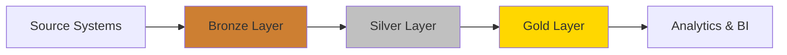

## Architecture Strategy

The SQL Data Warehouse implements a **medallion architecture** with three distinct layers, each serving a specific purpose in the data transformation pipeline:

<CardGroup cols={3}>
  <Card title="Bronze Layer" icon="database" href="/data-model/bronze-layer">
    Raw data ingestion from source systems
  </Card>
  <Card title="Silver Layer" icon="filter" href="/data-model/silver-layer">
    Cleansed and standardized data
  </Card>
  <Card title="Gold Layer" icon="star" href="/data-model/gold-layer">
    Business-ready analytics models
  </Card>
</CardGroup>

## Data Flow

Data flows through the warehouse in a unidirectional pipeline:



<Steps>
  <Step title="Bronze: Raw Ingestion">
    Data is loaded as-is from CRM and ERP systems with minimal transformation
  </Step>
  <Step title="Silver: Cleansing">
    Data quality improvements, type conversions, and standardization
  </Step>
  <Step title="Gold: Modeling">
    Star schema with facts and dimensions for analytical queries
  </Step>
</Steps>

## Source Systems

The warehouse consolidates data from two primary source systems:

<AccordionGroup>
  <Accordion title="CRM System" icon="users">
    **Customer Relationship Management** data including:
    - Customer information (demographics, contact details)
    - Product catalog (pricing, product lines)
    - Sales transactions (orders, quantities, pricing)
  </Accordion>
  
  <Accordion title="ERP System" icon="building">
    **Enterprise Resource Planning** data including:
    - Customer demographics (birth dates, gender)
    - Location information (country data)
    - Product categories and classification
  </Accordion>
</AccordionGroup>

## Gold Layer Star Schema

The Gold layer implements a **star schema** optimized for analytical queries:

### Schema Design

```sql
-- Fact Table (Center of the Star)
fact_sales
  ├── order_number
  ├── product_key (FK) ───> dim_product
  ├── customer_key (FK) ──> dim_customer
  ├── order_date
  ├── shipping_date
  ├── sales_amount
  ├── quantity
  └── price

-- Dimension Tables (Points of the Star)
dim_customer
  ├── customer_key (PK)
  ├── customer_id
  ├── first_name, last_name
  ├── marital_status
  ├── gender
  └── birth_date

dim_product
  ├── product_key (PK)
  ├── product_id
  ├── product_name
  ├── category, subcategory
  ├── product_cost
  └── product_line
```

### Star Schema Benefits

<CardGroup cols={2}>
  <Card title="Query Performance" icon="bolt">
    Simplified joins and optimized for aggregations
  </Card>
  <Card title="Intuitive Structure" icon="brain">
    Easy to understand and navigate for analysts
  </Card>
  <Card title="Scalability" icon="chart-line">
    Efficient with large fact tables
  </Card>
  <Card title="BI Tool Support" icon="chart-bar">
    Works seamlessly with reporting tools
  </Card>
</CardGroup>

## Key Design Principles

<Accordion title="Separation of Concerns">
  Each layer has a distinct responsibility:
  - **Bronze**: Preserve source data exactly as received
  - **Silver**: Apply business rules and data quality standards
  - **Gold**: Optimize for analytical use cases
</Accordion>

<Accordion title="Incremental Complexity">
  Transformations are applied progressively:
  - Start with raw data (Bronze)
  - Add cleansing and standardization (Silver)
  - Build dimensional models (Gold)
</Accordion>

<Accordion title="Audit Trail">
  Each layer maintains lineage:
  - Bronze preserves original source values
  - Silver adds `dwh_create_date` timestamps
  - Gold views reference Silver tables for traceability
</Accordion>

## Data Lineage

The warehouse maintains complete data lineage across all layers:

| Layer | Purpose | Retention | Transformations |
|-------|---------|-----------|----------------|
| Bronze | Source system mirror | Indefinite | None (raw data) |
| Silver | Cleansed enterprise data | Indefinite | Type conversions, null handling |
| Gold | Analytics models | As views | Joins, aggregations, business logic |

<Note>
  Gold layer objects are implemented as **views** rather than tables, ensuring they always reflect the latest Silver data without duplication.
</Note>

## Next Steps

<CardGroup cols={3}>
  <Card title="Bronze Layer" icon="arrow-right" href="/data-model/bronze-layer">
    Explore raw data tables
  </Card>
  <Card title="Silver Layer" icon="arrow-right" href="/data-model/silver-layer">
    Learn about cleansing logic
  </Card>
  <Card title="Gold Layer" icon="arrow-right" href="/data-model/gold-layer">
    View star schema details
  </Card>
</CardGroup>